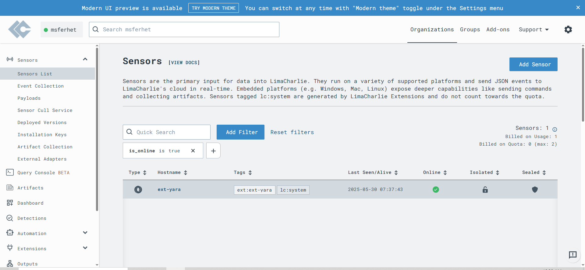

# SOAR EDR Project

## Table of Contents

- [Design](#Desgin)
- [Install LimaCharlie](#install-limacharlie)
- [Installation](#installation)
- [Usage](#usage)
- [Configuration](#configuration)
- [Contributing](#contributing)
- [License](#license)

## Desgin

###  Workflow Sequence

1. **Threat Detection**
   - A hacking tool or suspicious activity is detected on an endpoint by **LimaCharlie (EDR)**.

2. **Generate Alert**
   - LimaCharlie sends an **alert** to the **Tines (SOAR)** platform.

3. **Orchestrate Response**
   - Tines begins an automated response workflow.
   - It sends a **detailed message** to:
     - **Slack** (for analyst visibility)
     - **Gmail** (for email-based alerting)

   **Message Details Include:**
   - Time  
   - Computer Name  
   - Source IP  
   - Process  
   - Command Line  
   - File Path  
   - Sensor ID  

4. **Analyst Decision: Isolate Machine?**
   - Tines prompts the analyst (e.g., via Slack) with a question:
     > _“Do you want to isolate the affected machine?”_

5. **If the Analyst Responds "Yes":**
   - Tines sends a command to **LimaCharlie** to **isolate the compromised machine**.
   - LimaCharlie performs the isolation action.
   - A confirmation message is sent to **Slack**:
     - _"Computer `<computer>` isolated."_

6. **If the Analyst Responds "No":**
   - Tines sends a message to **Slack** instructing:
     - _"Please investigate."_
   - No isolation is performed; the alert awaits manual follow-up.

## Install LimaCharlie

### Step 1: Install Windows Server

First, we need a Windows Server machine to act as an agent. In this guide, we'll use VMware.

- Download the Windows Server ISO image from [this link](https://info.microsoft.com/ww-landing-windows-server-2019.html).
- In VMware, go to `File -> New Virtual Machine`.
- Choose your hardware settings and select the ISO image you downloaded.
- Start the virtual machine, and follow the installation wizard by clicking "Next" through the prompts.

> The Windows Server installation process is straightforward, and final will end up with windows server like this.

---

### Step 2: Sign Up on LimaCharlie

Now, create an account on [LimaCharlie](https://limacharlie.com).

- After signing up and creating an organization, you’ll see a dashboard like the one below:  
  

- Navigate to `Sensors -> Installation Keys` and click **Create Installation Key**.

> You can delete any other keys you don’t need.

---

### Step 3: Install the LimaCharlie Agent

- On the same `Installation Keys` page, scroll down to **Sensor Downloads**.
- Choose `Windows 64-bit` under the EDR section and copy the download link.
- On your Windows Server, paste the link into a browser to download the agent.

- Open the PowerShell window in the folder where you downloaded the agent.
- Run the installation command:
  

> Use the **Sensor Key** you created earlier under your Installation Key settings.

---

### Step 4: Verify the Agent

#### Option 1: Windows Services
Check that the **LimaCharlie service** is running via the Windows Services manager:

#### Option 2: LimaCharlie Dashboard
Alternatively, go to `Sensors -> Sensors List` in the LimaCharlie dashboard. You should see your Windows Server listed as a connected sensor.

