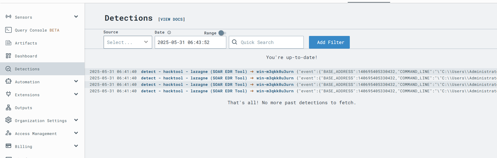

# SOAR EDR Project

## Table of Contents

- [Overview](#overview)
- [Design](#Desgin)
- [Install LimaCharlie](#install-limacharlie)
- [Create Threat Simulation](#create-threat-simulation)
- [Connect EDR to SOAR](#connect-edr-to-soar)
- [Automation](#automation)

## Overview

This project demonstrates the integration of LimaCharlie as an Endpoint Detection and Response (EDR) solution with Tines as a Security Orchestration, Automation, and Response (SOAR) platform. It walks through setting up LimaCharlie on a Windows Server virtual machine, creating custom detection rules for malicious tools like LaZagne, and automating incident response workflows through Tines.

Key capabilities include:

- Real-time detection of known attack behaviors using LimaCharlie.
- Sending detection alerts to Tines via webhooks.
- Delivering notifications to security analysts through Slack and email.
- Providing analysts with an interactive decision page to approve or reject isolation actions.
- Automatically isolating infected endpoints and confirming the action with follow-up alerts.

The result is a functional, end-to-end SOAR pipeline suitable for small- to medium-scale incident response automation projects.

## Desgin


###  Workflow Sequence

1. **Threat Detection**
   - A hacking tool or suspicious activity is detected on an endpoint by **LimaCharlie (EDR)**.

2. **Generate Alert**
   - LimaCharlie sends an **alert** to the **Tines (SOAR)** platform.

3. **Orchestrate Response**
   - Tines begins an automated response workflow.
   - It sends a **detailed message** to:
     - **Slack** (for analyst visibility)
     - **Gmail** (for email-based alerting)

   **Message Details Include:**
   - Time  
   - Computer Name  
   - Source IP  
   - Process  
   - Command Line  
   - File Path  
   - Sensor ID  

4. **Analyst Decision: Isolate Machine?**
   - Tines prompts the analyst (e.g., via Slack) with a question:
     > _“Do you want to isolate the affected machine?”_

5. **If the Analyst Responds "Yes":**
   - Tines sends a command to **LimaCharlie** to **isolate the compromised machine**.
   - LimaCharlie performs the isolation action.
   - A confirmation message is sent to **Slack**:
     - _"Computer `<computer>` isolated."_

6. **If the Analyst Responds "No":**
   - Tines sends a message to **Slack** instructing:
     - _"Please investigate."_
   - No isolation is performed; the alert awaits manual follow-up.


## Install LimaCharlie

### Step 1: Install Windows Server

First, we need a Windows Server machine to act as an agent. In this guide, we'll use VMware.

- Download the Windows Server ISO image from [this link](https://info.microsoft.com/ww-landing-windows-server-2019.html).
- In VMware, go to `File -> New Virtual Machine`.
- Choose your hardware settings and select the ISO image you downloaded.
- Start the virtual machine, and follow the installation wizard by clicking "Next" through the prompts.

> The Windows Server installation process is straightforward, and final will end up with windows server like this.


---

### Step 2: Sign Up on LimaCharlie

Now, create an account on [LimaCharlie](https://limacharlie.com).

- After signing up and creating an organization, you’ll see a dashboard like the one below:  
  

- Navigate to `Sensors -> Installation Keys` and click **Create Installation Key**.

> You can delete any other keys you don’t need.


---

### Step 3: Install the LimaCharlie Agent

- On the same `Installation Keys` page, scroll down to **Sensor Downloads**.
- Choose `Windows 64-bit` under the EDR section and copy the download link.
- On your Windows Server, paste the link into a browser to download the agent.


- Open the PowerShell window in the folder where you downloaded the agent.
- Run the installation command:
  

> Use the **Sensor Key** you created earlier under your Installation Key settings.

---

### Step 4: Verify the Agent

#### Option 1: Windows Services
Check that the **LimaCharlie service** is running via the Windows Services manager:


#### Option 2: LimaCharlie Dashboard
Alternatively, go to `Sensors -> Sensors List` in the LimaCharlie dashboard. You should see your Windows Server listed as a connected sensor.


## Create Threat Simulation

### Step 1: Download the Hack Tool

We will use **Lazagne**, a credential dumping tool, as our simulated attack.

- Download Lazagne on the Windows Server machine.
- You can find it [here](https://github.com/AlessandroZ/LaZagne) (use the precompiled binary).
- **Important:** Disable Windows Defender before running it, as it will block the tool.

Once downloaded, open **PowerShell** and run Lazagne like this:


---

### Step 2: Detect the Tool in LimaCharlie

Now, switch to the **LimaCharlie dashboard** to observe if the tool activity was detected:

1. Go to `Sensors -> Sensor List`.
2. Click on your Windows Server machine.
3. In the sidebar, go to the **Timeline** tab.
4. Search for `lazagne`.

You should see events like this:


---

### Step 3: Create a Detection Rule

To build a detection rule specific to Lazagne, go to:

```
Automation -> D&R Rules
```

After reviewing the documentation and with help from ChatGPT, I created a rule that has two parts: **Detection Logic** and **Response Metadata**.

#### 🧠 Detection Logic

```yaml
events:
  - NEW_PROCESS
  - EXISTING_PROCESS
op: and
rules:
  - op: is windows
  - op: or
    rules:
      - case sensitive: false
        op: ends with
        path: event/FILE_PATH
        value: lazagne.exe
      - case sensitive: false
        op: contains
        path: event/COMMAND_LINE
        value: lazagne.exe
      - case sensitive: false
        op: is
        path: event/HASH
        value: 'dc06d62ee95062e714f2566c95b8edaabfd387023b1bf98a09078b84007d5268'
```

#### ⚙️ Response Metadata

```yaml
- action: report
  metadata:
    - author: msferhet
    - description: Detect Lazagne (SOAR EDR Tool)
    - falsepositive: to moon
    - level: medium
  tags:
    - attack credential access
  name: detect - hacktool - lazagne (SOAR EDR Tool)
```

---

### Step 4: Test the Rule

Once the rule is created, scroll down and click **Create**.

Then:

1. Under the rule, find and click on **Target Event**.
2. Go back to the **Timeline**, find a Lazagne-related event.
3. Copy the event JSON and paste it into the test field.
4. Click **Test Event**.


---

### Step 5: Validate Detection

Re-run Lazagne on your Windows Server.

Then:

1. Go back to LimaCharlie.
2. Navigate to the **Detection** tab.
3. Wait a moment — you should see a detection alert like this:



✅ **Success!** Your custom rule is now actively detecting malicious tool usage.

## Connect EDR to SOAR

Now let's connect our **EDR (LimaCharlie)** to our **SOAR platform (Tines)**.

### Step 1: Create a Tines Account

1. Go to [tines.com](https://tines.com) and sign up for a free account.
2. Inside your **Story**, delete all default actions to start clean.
3. Add a new **Webhook** action and name it something like `EDR-SOAR-Hook`.
4. Copy the generated Webhook URL.


---

### Step 2: Configure LimaCharlie Output

Next, configure LimaCharlie to forward detection alerts to Tines.

1. In the LimaCharlie dashboard, go to `Output -> Add Output`.
2. Set the following values:
   - **Stream**: `detection`
   - **Destination**: `tines`
   - **Name**: Choose any descriptive name (e.g., `EDR_to_Tines`)
   - **Destination Host**: Paste the Webhook URL you copied from Tines


---

### Step 3: Trigger a Detection

Run **Lazagne** again on your Windows Server to generate a detection alert. This serves as a sample event to verify the connection.

After running the tool, refresh your LimaCharlie samples by clikc on `Refresh Samples`. You should see recent detection logs being sent:


---

### Step 4: Verify Events in Tines

Switch back to Tines and:

1. Click on your **Webhook** action.
2. Go to the **Events**.

You should see the alert received from LimaCharlie:


✅ The integration is now successfully established and active!

## Automation

### Connect Slack

First, create a **Slack** account and set up a **new workspace**. Inside the workspace, create a channel called `#alerts`.

1. In Slack, click `More` on the left sidebar, then go to `Automation -> Apps`.
2. Search for `Tines` and follow the steps to install the Tines app in Slack.

To connect Tines:

1. In your Tines story, click on any empty space.
2. On the right-hand panel, click `Credentials` and search for `Slack`.
3. Click on `Use Slack App for Tines` to authorize the connection.

Next, in Tines:

1. On the left, search for the **Slack** template.
2. Add the **Send a Message** action to your story.
3. In Slack, right-click on the `#alerts` channel and select `View Channel Details`. Scroll to the bottom to find and copy the **Channel ID**.
4. Paste the Channel ID into the Tines action.

Now we’ll build the Slack message. Go back to your **Webhook** action in Tines, open an event, and use the event data to craft your message. Here’s a sample:

```yaml
Title: <<edr_soar_hook.body.cat>>
Time: <<edr_soar_hook.body.gen_time>>
Computer Name: <<edr_soar_hook.body.detect.routing.hostname>>
Command Line: <<edr_soar_hook.body.detect.event.COMMAND_LINE>>
User Name: <<edr_soar_hook.body.detect.event.PARENT.USER_NAME>>
Sensor ID: <<edr_soar_hook.body.detect.routing.sid>>
Link: <<edr_soar_hook.body.link>>
```

Paste this message template into the **Slack message body** field (adjust based on your webhook name).

To test the Slack integration, click `Test` on the Slack action and select an event.


---

### Send Email Notifications

To send alerts via email:

1. Add the **Email** template from the Tines library.
2. Link it to the same webhook.
3. In the `Recipients` field, enter your email.
4. Copy the same alert message from Slack into the `Body` field.

Test it using the same method as above.


You can customize the email body further using HTML later.

---

### Create Analyst Response Page

To create a user prompt:

1. From the Tines tools, drag the **Page** action into your story and link it to the webhook.
2. Click the Page and hit `Edit` to design it. Add a header, text block, boolean input, and submit button.


Now create the "NO" response path:

1. Add a **Trigger** action from templates or copy one.
2. Set a rule where `page_action.body.isolate` equals `false`.
3. Link this to a Slack action and change the message to:

```yaml
Computer <<edr_soar_hook.body.detect.routing.hostname>> is infected. Please investigate.
```

To test, go to the webhook, open `Events`, and re-send an event to the action page. Submit the form with `NO` selected and check Slack for the message.

Now create the "YES" response path:

1. Copy the previous Trigger or add a new one. Change the rule to `true`.
2. Search for **LimaCharlie** in Tines templates and add the **Isolate Sensor** action.

Configure the action:

* In the `URL` field, enter: `<<edr_soar_hook.body.detect.routing.sid>>`

Then, create a credential in Tines:

1. In LimaCharlie, go to `Access Management -> REST API` and copy the **Org JWT**.
2. In Tines, go to `Credentials`, create a new credential of type `Text`.
3. Name it, paste the JWT in `Value`, set the domain as `*limacharlie.io`.
4. Save it.

In the LimaCharlie Tines action, under `Headers -> Bearer`, enter:

```
CREDENTIAL.name-of-your-credential
```

Test the flow by generating a new event and selecting `YES`. You should see the sensor status change:

* **Before Isolation:**
  

* **After Isolation:**
  

Try pinging `google.com` from the machine to verify the isolation:


Lastly, notify the team via Slack by duplicating the Slack action and changing the message to:

```yaml
Sensor <<edr_soar_hook.body.detect.routing.sid>> has been isolated.
```

You should now have a complete automation workflow like this:


